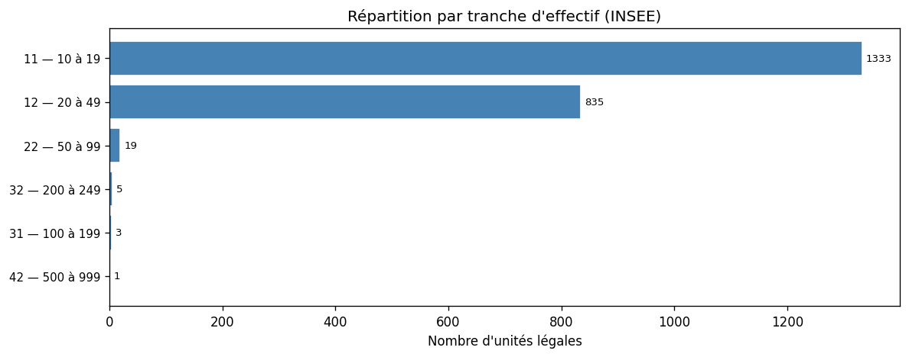
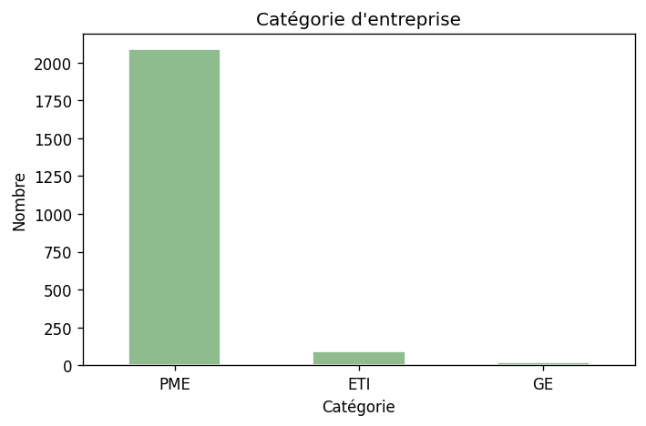
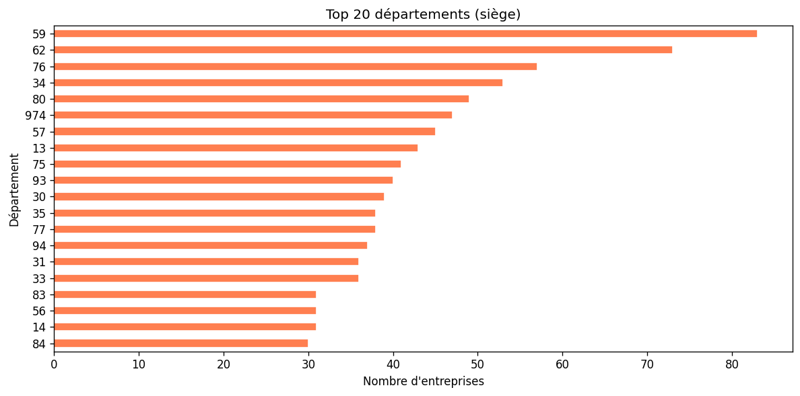
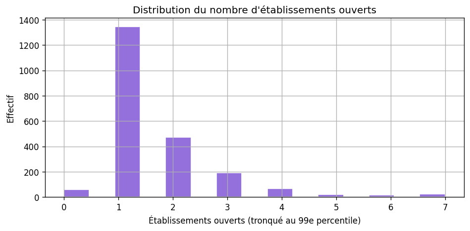

# Analyse des prospects — ambulances / transport sanitaire (NAF 86.90A)

**CSV :** `data/prospects_ambulances.csv` · **Notebook :** `SECTOR_ID = "ambulances"`

Méthode : [METHODOLOGIE-API.md](./METHODOLOGIE-API.md).

```bash
python scripts/prospecting/fetch_sector_prospects.py --sector ambulances
python scripts/prospecting/export_analysis_figures.py --sector ambulances
```

---

## Qualité et volumes

| Indicateur | Valeur |
|------------|--------|
| Lignes | 2 196 |
| Dirigeants renseignés (API) | ~99,8 % |
| Shortlist ICP indicative | 732 |

**Catégories :** PME 2 087 · ETI 92 · GE 17  

**Établissements ouverts (médiane / max) :** 1 / 52  

**Top départements :** 59, 62, 76, 34, 80  

---

## Calibration clients (trois paliers)

**Unité métier double :** **véhicule** (CT, équipement, ARS) et **personne** (DEA, AFGSU, visite). L’export ne contient **pas** le parc véhicules : les comptages utilisent **établissements ouverts** comme **proxy d’agences** (`stats-secteurs.json` → `ambulances.segments_clients`).

### Profils métier (indicatif)

| Palier | Agences / sites | Véhicules | Salariés (tot.) | CA (ordre de grandeur) | Prix mois | Cycle |
|--------|-----------------|-----------|-----------------|------------------------|-----------|-------|
| Seuil minimal | 2–3 | 8–15 | 15–25 | 800 k€–1,5 M€ | 250–350 € | 2–4 sem. |
| Cœur de cible | 3–8 | 20–60 | 40–120 | 2–8 M€ | 500–900 € | 4–7 sem. |
| Plafond bootstrap | 8–15 | 60–120 | 120–250 | 8–20 M€ | 1 000–1 800 € | 7–12 sem. |

**Spécificité :** marges sous pression (tarifs CPAM) → l’argument **coût d’immobilisation** (véhicule / agent) prime sur le prix seul.

### Unités légales dans ce fichier (proxy agences = étab. ouverts)

| Palier | UL |
|--------|-----|
| Seuil minimal | **630** |
| Cœur de cible | **115** |
| Plafond bootstrap | **8** |

---

## Tranches d’effectif

| Code | Nombre |
|------|--------|
| 11 | 1 333 |
| 12 | 835 |
| 22 | 19 |
| 31 | 3 |
| 32 | 5 |
| 42 | 1 |









---

## Lecture stratégique

Très proche du **modèle CNAPS** : conformité **binaire**, peu d’ambiguïté. Multi-sites **modéré** (bases / garages). TAM plus étroit que crèches / EHPAD mais **fichier riche** pour outbound. Voir [SYNTHESE-COMPARATIVE-SECTEURS.md](./SYNTHESE-COMPARATIVE-SECTEURS.md).
