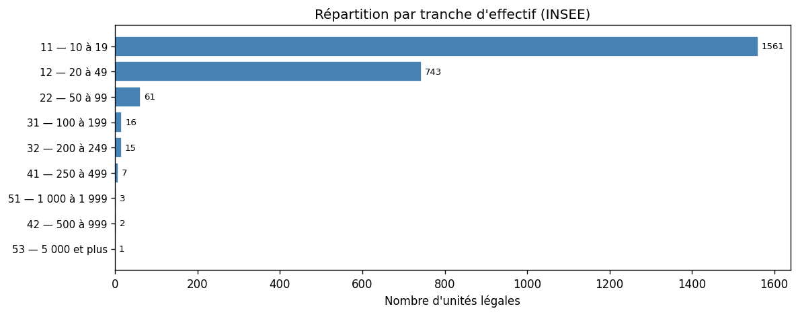
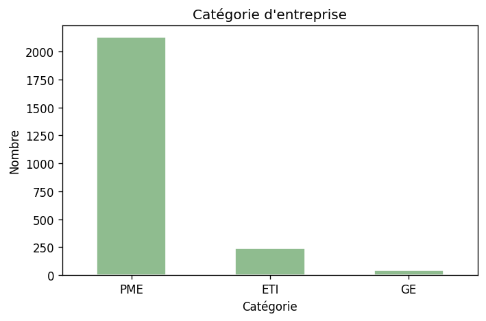
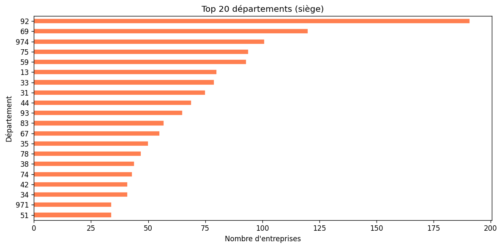
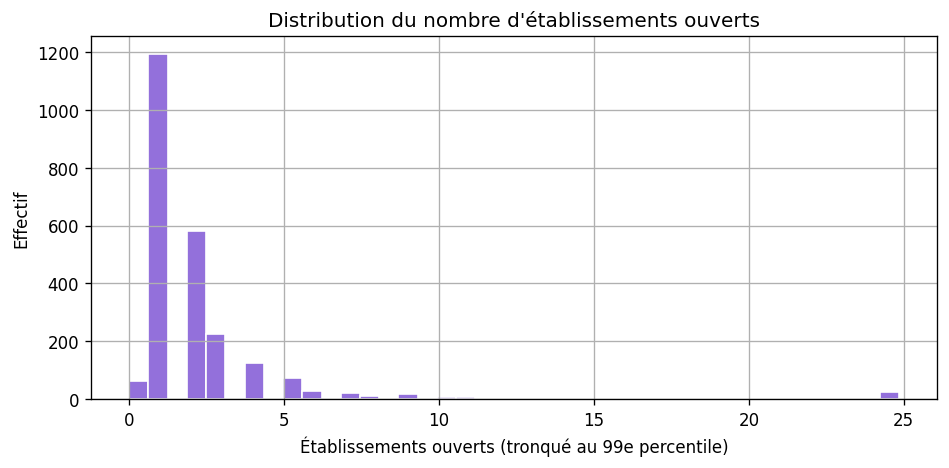

# Analyse des prospects — accueil jeune enfant (NAF 88.91A)

**Fichier :** `data/prospects_creches_8891a.csv`  
**Notebook :** `notebooks/analyse_prospects_creches_8891a.ipynb` ou `analyse_prospects_sectoriel.ipynb` (`SECTOR_ID = "creches"`)

Méthode : [METHODOLOGIE-API.md](./METHODOLOGIE-API.md).

**Jeu analysé :** 2 409 unités légales.

```bash
python scripts/prospecting/fetch_sector_prospects.py --sector creches
python scripts/prospecting/export_analysis_figures.py --sector creches
```

---

## Qualité et volumes

| Indicateur | Valeur |
|------------|--------|
| Lignes | 2 409 |
| Dirigeants renseignés (API) | ~50,4 % |
| Shortlist ICP indicative | 869 |

**Catégories :** PME 2 128 · ETI 240 · GE 41  

**Établissements ouverts (médiane / max) :** 1 / 496  

**Top départements :** 92, 69, 974, 75, 59  

**Attention prospection :** taux de dirigeants API **bas** — enrichissement externe souvent nécessaire.

---

## Calibration clients (trois paliers)

**Vocabulaire :** **seuil minimal** = plus petit compte encore rentable (support + churn) ; **cœur de cible** = ICP idéal bootstrap (douleur forte, décideur accessible) ; **plafond bootstrap** = plus gros compte gérable sans cycle « enterprise » (SSO, SIRH, SLA).

Les **CA** et rôles précis ne sont **pas** dans l’export Sirene : le tableau métier ci-dessous est **indicatif** (atelier stratégique). Les **comptages** recoupent le CSV avec `nombre_etablissements_ouverts`, `tranche_effectif_salarie` et `categorie_entreprise` — voir `stats-secteurs.json` → `creches.segments_clients` et `python scripts/prospecting/sector_stats.py -o docs/prospects/stats-secteurs.json`.

### Profils métier (indicatif)

| Palier | Établissements | Salariés (tot.) | CA (ordre de grandeur) | Prix mois / setup | Cycle | Churn |
|--------|----------------|-----------------|------------------------|-------------------|-------|-------|
| Seuil minimal | 3 | 25–35 | 800 k€–1,2 M€ | 300–400 € / ~500 € | 3–5 sem. | Élevé |
| Cœur de cible | 6–15 | 80–180 | 3–8 M€ | 600–1 200 € / 1 000–1 500 € | 4–8 sem. | Faible |
| Plafond bootstrap | 15–30 | 200–400 | 8–20 M€ | 1 500–2 500 € / ~2 000 € | 8–12 sem. | Très faible |

**Utilisateurs / décideurs typiques :** au seuil, souvent la **DG** seule au siège ; au cœur, un **admin / RH siège** + directrices de site ; au plafond, **RH + assistante de direction**, parfois **directrice régionale** intermédiaire.

### Unités légales dans ce fichier (proxy API)

| Palier | UL |
|--------|-----|
| Seuil minimal | **346** |
| Cœur de cible | **87** |
| Plafond bootstrap | **21** |

**Rappels :** shortlist historique (PME, TEF 10–49 sal., ≥ 2 étab.) = **869** UL ; même shortlist avec **≥ 3 étab.** = **422** UL (filtre « douleur multi-sites »).

---

## Tranches d’effectif

| Code | Nombre |
|------|--------|
| 11 | 1 561 |
| 12 | 743 |
| 22 | 61 |
| 31 | 16 |
| 32 | 15 |
| 41 | 7 |
| 42 | 2 |
| 51 | 3 |
| 53 | 1 |









---

## Lecture stratégique

**Référence** sur les critères multi-sites / codification / douleur : [SYNTHESE-COMPARATIVE-SECTEURS.md](./SYNTHESE-COMPARATIVE-SECTEURS.md).
