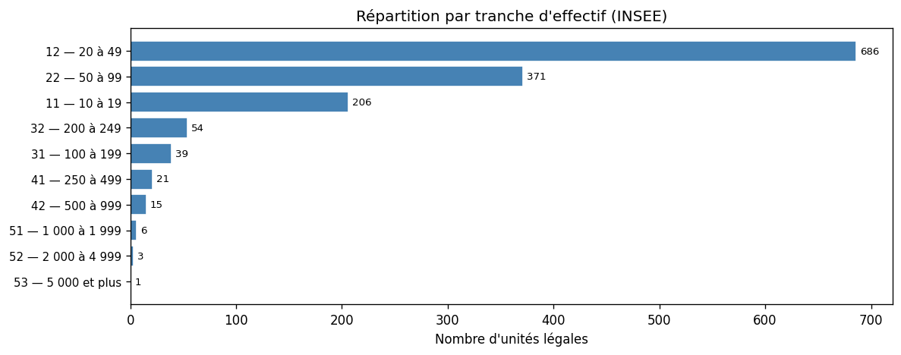
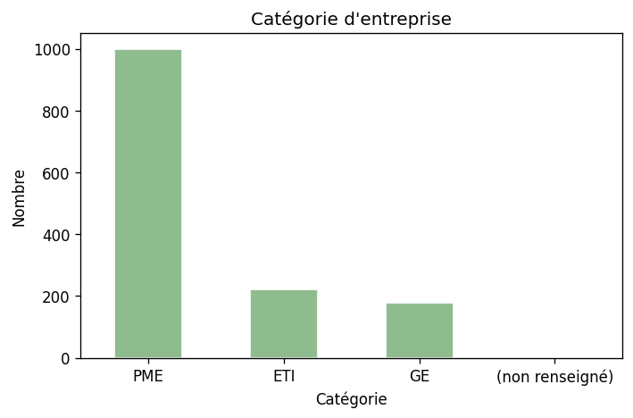
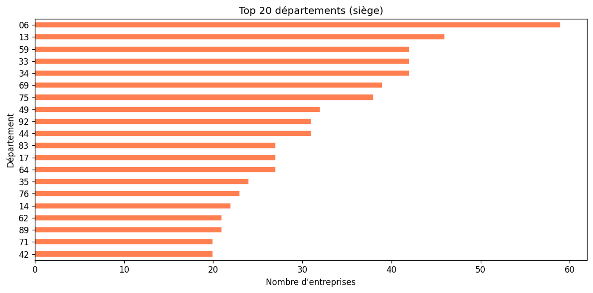
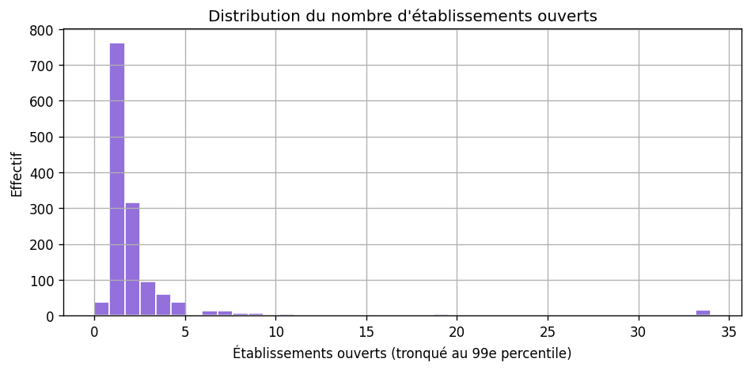

# Analyse des prospects — EHPAD / hébergement personnes âgées (NAF 87.10A + 87.30A)

**Fichiers NAF fusionnés (dédoublonnage SIREN) :**

- **87.10A** — Hébergement médicalisé pour personnes âgées  
- **87.30A** — Hébergement social pour personnes âgées  

**CSV :** `data/prospects_ehpad.csv` · **Notebook :** `analyse_prospects_sectoriel.ipynb` (`SECTOR_ID = "ehpad"`)

Méthode : [METHODOLOGIE-API.md](./METHODOLOGIE-API.md).

```bash
python scripts/prospecting/fetch_sector_prospects.py --sector ehpad
python scripts/prospecting/export_analysis_figures.py --sector ehpad
```

---

## Qualité et volumes

| Indicateur | Valeur |
|------------|--------|
| Lignes | 1 402 |
| Dirigeants renseignés (API) | ~38,1 % |
| Shortlist ICP indicative | 143 |

**Catégories :** PME 1 000 · ETI 222 · **GE 178** (part plus élevée que crèches / sécurité — gros groupes)  

**Établissements ouverts (médiane / max) :** 1 / 237  

**Top départements :** 06, 13, 59, 33, 34  

---

## Calibration clients (trois paliers)

Même logique que pour les crèches : **seuil minimal** / **cœur de cible** / **plafond bootstrap**. CA et tickets : discussion stratégique ; **comptages** = proxy sur le CSV (`stats-secteurs.json` → `ehpad.segments_clients`, `sector_stats.py`).

### Profils métier (indicatif)

| Palier | Établissements | Salariés (tot.) | CA (ordre de grandeur) | Prix mois (indicatif) | Cycle |
|--------|----------------|-----------------|------------------------|------------------------|-------|
| Seuil minimal | 2–3 | 60–100 | 3–6 M€ | 500–700 € | 4–6 sem. |
| Cœur de cible | 5–12 | 200–500 | 12–35 M€ | 1 000–2 000 € | 6–10 sem. |
| Plafond bootstrap | 12–25 | 500–1 200 | 35–80 M€ | 2 000–4 000 € | 10–16 sem. |

**Spécificité :** DAF / outils métier souvent déjà présents → cycles plus longs que crèches ; ticket naturellement plus élevé (CA par résidence).

### Unités légales dans ce fichier (proxy API)

Comptages **PME + ETI** (hors GE dans les règles proxy) — les **gros groupes** (GE) sortent du périmètre « plafond bootstrap » ici mais restent une cible **plus tard** avec cycle enterprise.

| Palier | UL |
|--------|-----|
| Seuil minimal | **395** |
| Cœur de cible | **73** |
| Plafond bootstrap | **21** |

---

## Tranches d’effectif

| Code | Nombre |
|------|--------|
| 11 | 206 |
| 12 | 686 |
| 22 | 371 |
| 31 | 39 |
| 32 | 54 |
| 41 | 21 |
| 42 | 15 |
| 51 | 6 |
| 52 | 3 |
| 53 | 1 |









---

## Lecture stratégique

Obligations **massives** (ARS, formations, équipements), douleur **maximale** en cas de retrait d’autorisation. Multi-sites **très fort** pour les groupes. Dirigeants API souvent absents — enrichissement critique. Voir synthèse : [SYNTHESE-COMPARATIVE-SECTEURS.md](./SYNTHESE-COMPARATIVE-SECTEURS.md).
