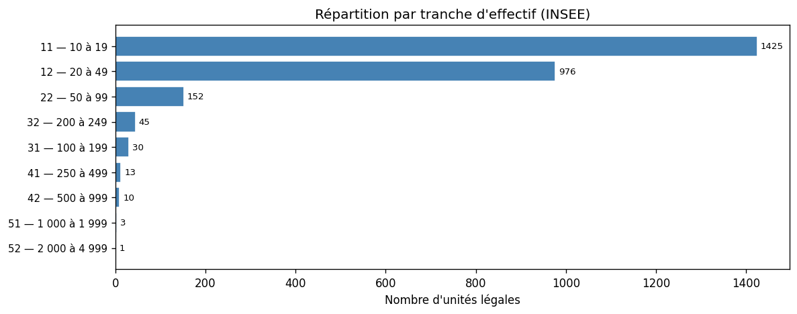
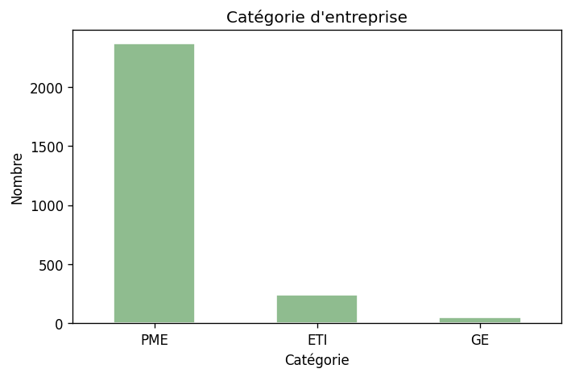
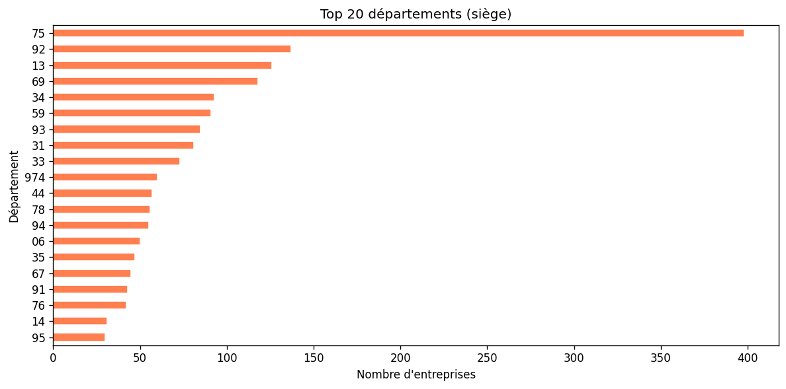
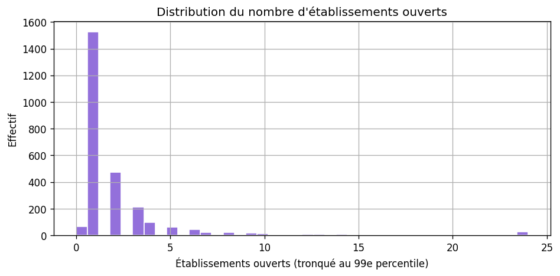

# Analyse des prospects — organismes de formation (NAF 85.59A + 85.59B)

**NAF fusionnés :**

- **85.59A** — Autres enseignements (formation continue adultes)  
- **85.59B** — Autres enseignements  

**CSV :** `data/prospects_organisme_formation.csv` · **Notebook :** `SECTOR_ID = "organisme-formation"`

Méthode : [METHODOLOGIE-API.md](./METHODOLOGIE-API.md).

```bash
python scripts/prospecting/fetch_sector_prospects.py --sector organisme-formation
python scripts/prospecting/export_analysis_figures.py --sector organisme-formation
```

---

## Qualité et volumes

| Indicateur | Valeur |
|------------|--------|
| Lignes | 2 655 |
| Dirigeants renseignés (API) | ~56,2 % |
| Shortlist ICP indicative | 754 |

**Catégories :** PME 2 365 · ETI 238 · GE 52  

**Établissements ouverts (médiane / max) :** 1 / 230  

**Top départements :** 75, 92, 13, 69, 34  

---

## Calibration clients (trois paliers)

Marché **atomisé** ; **Qualiopi** = douleur réelle mais **sanction différée** (audit ~18 mois) → urgence perçue plus faible que CNAPS / agrément petite enfance.

### Profils métier (indicatif)

| Palier | Centres / sites | Formateurs suivis | Salariés (tot.) | CA (ordre de grandeur) | Prix mois | Cycle |
|--------|-----------------|-------------------|-----------------|------------------------|-----------|-------|
| Seuil minimal | 2–3 | 10–25 | 8–20 | 500 k€–1 M€ | 200–300 € | 2–4 sem. |
| Cœur de cible | 4–10 | 30–100 | 25–80 | 2–6 M€ | 400–800 € | 4–7 sem. |
| Plafond bootstrap | 10–20 | 100–250 | 80–180 | 6–15 M€ | 800–1 500 € | 6–10 sem. |

### Unités légales dans ce fichier (proxy : étab. ouverts = lieux)

| Palier | UL |
|--------|-----|
| Seuil minimal | **566** |
| Cœur de cible | **256** |
| Plafond bootstrap | **46** |

---

## Tranches d’effectif

| Code | Nombre |
|------|--------|
| 11 | 1 425 |
| 12 | 976 |
| 22 | 152 |
| 31 | 30 |
| 32 | 45 |
| 41 | 13 |
| 42 | 10 |
| 51 | 3 |
| 52 | 1 |









---

## Lecture stratégique

**Qualiopi** = cadre exigeant mais **moins administratif « binaire »** que CNAPS/PMI au quotidien ; concurrence d’outils **LMS / référentiels** déjà présents. Bon volume de **shortlist** multi-sites. Voir [SYNTHESE-COMPARATIVE-SECTEURS.md](./SYNTHESE-COMPARATIVE-SECTEURS.md).
