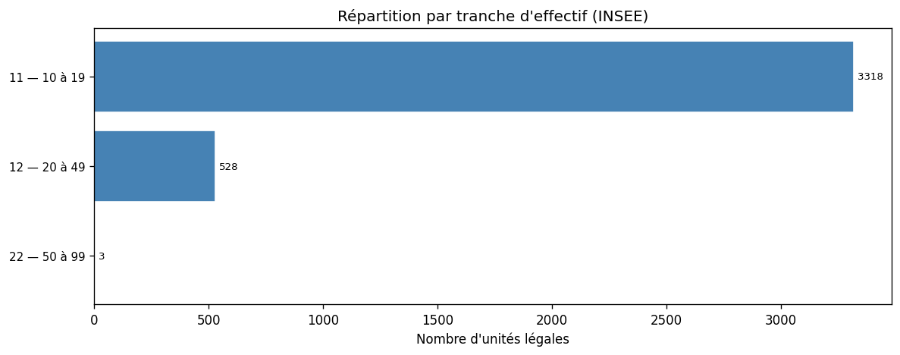
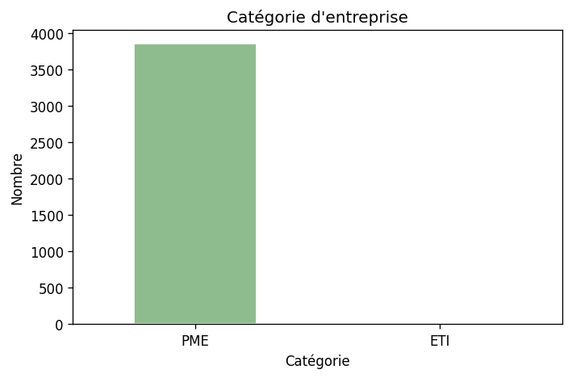
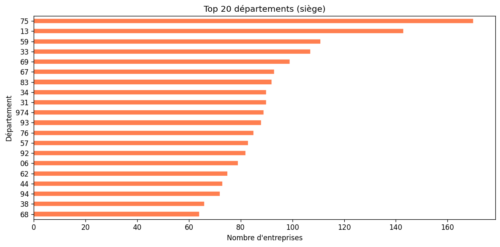
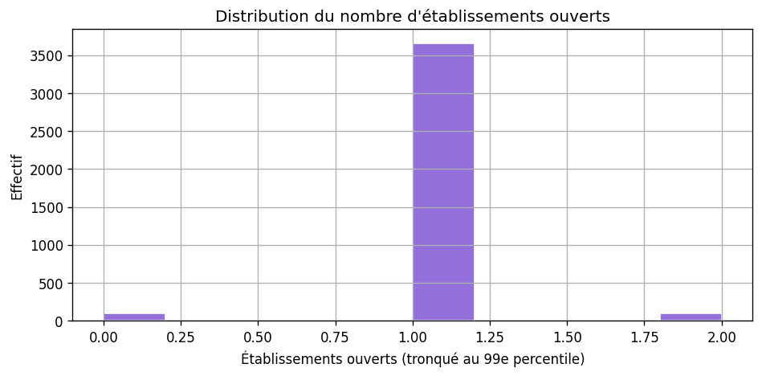

# Analyse des prospects — pharmacies (détail en magasin spécialisé, NAF 47.73Z)

**CSV :** `data/prospects_pharmacies.csv` · **Notebook :** `SECTOR_ID = "pharmacies-reseau"`

Méthode : [METHODOLOGIE-API.md](./METHODOLOGIE-API.md).

> **Lecture du NAF**  
> **47.73Z** couvre le **commerce de détail pharmaceutique en magasin spécialisé**. La plupart des lignes correspondent à **une officine = une unité légale** : la **médiane d’établissements ouverts est 1**. La shortlist « multi-sites » (≥ 2 établissements) est donc **volontairement petite** ; les **réseaux** peuvent aussi passer par des structures holding / sociétés de gestion avec d’autres codes NAF — à compléter en prospection manuelle.

```bash
python scripts/prospecting/fetch_sector_prospects.py --sector pharmacies-reseau
python scripts/prospecting/export_analysis_figures.py --sector pharmacies-reseau
```

---

## Qualité et volumes

| Indicateur | Valeur |
|------------|--------|
| Lignes | 3 849 |
| Dirigeants renseignés (API) | ~99,8 % |
| Shortlist ICP indicative (≥ 2 établ.) | 93 |

**Catégories :** PME **3 847** · ETI 2 · GE 0  

**Établissements ouverts (médiane / max) :** 1 / 7  

**Top départements :** 75, 13, 59, 33, 69  

---

## Calibration clients (trois paliers)

**Contrainte structurelle :** plafond **légal** d’**officines** par titulaire → le « maximal » métier est **borné** ; ticket et volume **réseau** sont souvent **sous-représentés** dans le seul NAF **47.73Z** (holding, autres codes).

### Profils métier (indicatif)

| Palier | Officines | Salariés (tot.) | CA (ordre de grandeur) | Prix mois | Cycle |
|--------|-----------|-----------------|------------------------|-----------|-------|
| Seuil minimal | 2 | 10–20 | 2–4 M€ | 300–400 € | 2–4 sem. |
| Cœur de cible | 3 (+ participations) | 20–40 | 5–10 M€ | 500–800 € | 3–6 sem. |
| Plafond bootstrap | 3 (+ structure groupe) | 40–80 | 10–20 M€ | 800–1 200 € | 5–8 sem. |

**Spécificité :** **décision rapide** (titulaire) ; bonne **habitude SaaS métier** ; niche **volume** possible en complément d’une verticale à ticket plus élevé.

### Unités légales dans ce fichier (proxy : étab. ouverts)

| Palier | UL |
|--------|-----|
| Seuil minimal | **90** |
| Cœur de cible | **6** |
| Plafond bootstrap | **9** |

---

## Tranches d’effectif

| Code | Nombre |
|------|--------|
| 11 | 3 318 |
| 12 | 528 |
| 22 | 3 |









---

## Lecture stratégique

Obligations **lourdes** (Ordre, ARS, DPC) et **ticket** potentiellement élevé, mais **construction du registre métier** la plus **coûteuse**. Ce fichier sert surtout de **base brute** ; la cible « réseau » nécessite **filtrage et enrichissement** (même enseigne, liens capitalistiques). Voir [SYNTHESE-COMPARATIVE-SECTEURS.md](./SYNTHESE-COMPARATIVE-SECTEURS.md).
