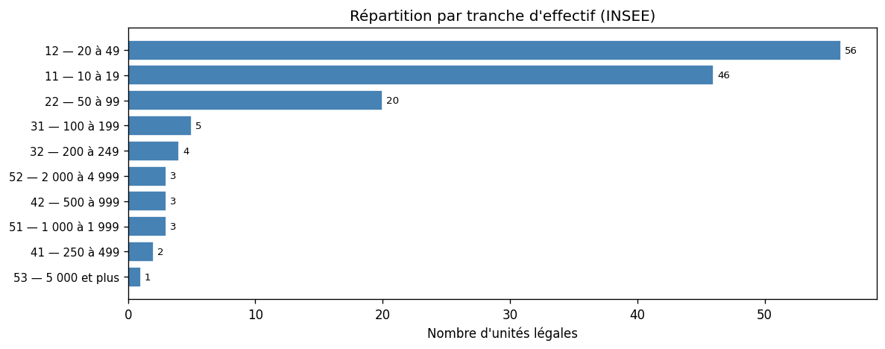
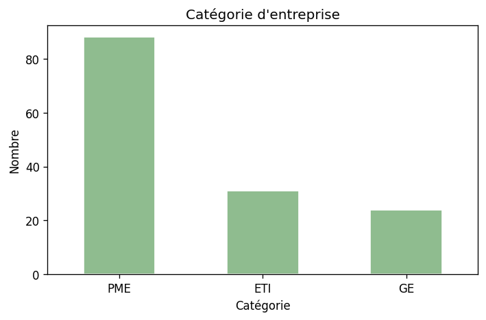
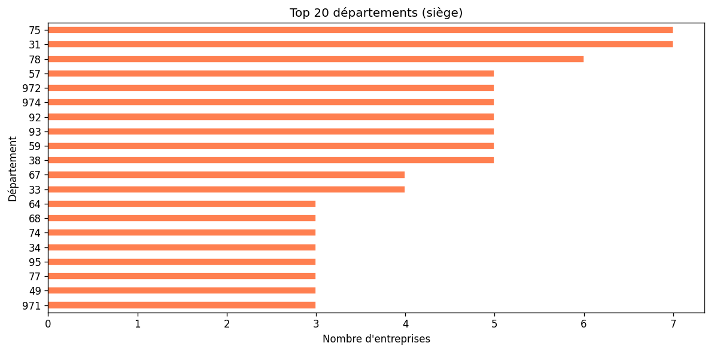
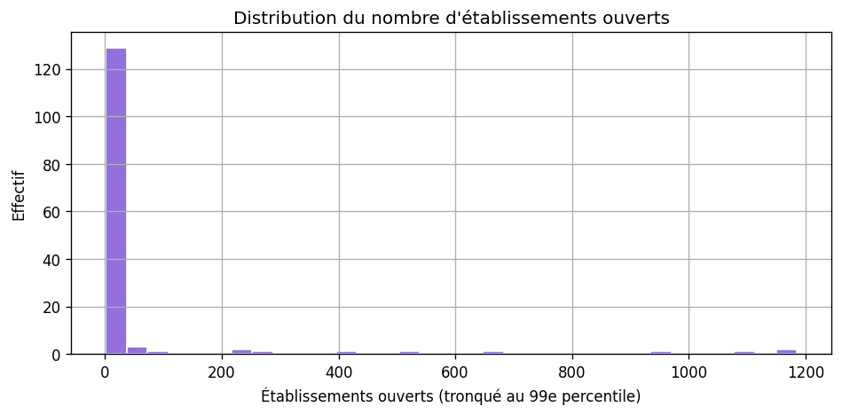

# Analyse des prospects — NAF 56.29A (autres services de restauration)

**CSV :** `data/prospects_restauration_collective.csv` · **Notebook :** `SECTOR_ID = "restauration-collective"`

Méthode : [METHODOLOGIE-API.md](./METHODOLOGIE-API.md).

> **Limite méthodologique importante**  
> Le code **56.29A** avec filtre **effectif ≥ 10 salariés** ne représente qu’une **fraction** des acteurs « restauration collective / traiteurs multi-sites » au sens métier. Beaucoup de structures sont classées sous **d’autres NAF** (hôtellerie-restauration traditionnelle, activités de siège, etc.). Les **143** unités ci-dessous sont un **plancher** pour ce code précis, **pas** une estimation du marché adressable total. Pour une prospection large, il faudra **d’autres requêtes NAF** et/ou sources complémentaires.

```bash
python scripts/prospecting/fetch_sector_prospects.py --sector restauration-collective
python scripts/prospecting/export_analysis_figures.py --sector restauration-collective
```

---

## Qualité et volumes

| Indicateur | Valeur |
|------------|--------|
| Lignes | 143 |
| Dirigeants renseignés (API) | ~89,5 % |
| Shortlist ICP indicative | 30 |

**Catégories :** PME 88 · ETI 31 · GE 24  

**Établissements ouverts (médiane / moyenne / max) :** 2 / **56,5** / **1 726** — forte concentration de gros opérateurs dans ce sous-échantillon.

**Top départements :** 75, 31, 78, 57, 972  

---

## Calibration clients (trois paliers)

**Lecture métier :** l’unité utile est souvent le **site client géré** (réfectoires) plus que l’UL INSEE seule. Le fichier **56.29A** est un **échantillon réduit** : les volumes ci-dessous sont des **ordres de grandeur sur ce CSV**, pas le SAM restauration collective.

### Profils métier (indicatif)

| Palier | Sites gérés | Salariés (tot.) | CA (ordre de grandeur) | Prix mois | Cycle |
|--------|-------------|-----------------|------------------------|-----------|-------|
| Seuil minimal | 3–5 | 20–40 | 1–2 M€ | 350–500 € | 3–5 sem. |
| Cœur de cible | 8–20 | 60–180 | 4–12 M€ | 700–1 400 € | 5–9 sem. |
| Plafond bootstrap | 20–50 | 180–400 | 12–30 M€ | 1 500–2 500 € | 9–14 sem. |

**Spécificité :** turnover **très élevé** → le produit doit rendre l’**entrée / sortie** des collaborateurs quasi instantanée. **Grandes enseignes** (Sodexo, Elior, Compass) : hors scope bootstrap (outils internes).

### Unités légales dans ce fichier (proxy : étab. ouverts)

| Palier | UL |
|--------|-----|
| Seuil minimal | **16** |
| Cœur de cible | **5** |
| Plafond bootstrap | **7** |

---

## Tranches d’effectif

| Code | Nombre |
|------|--------|
| 11 | 46 |
| 12 | 56 |
| 22 | 20 |
| 31 | 5 |
| 32 | 4 |
| 41 | 2 |
| 42 | 3 |
| 51 | 3 |
| 52 | 3 |
| 53 | 1 |









---

## Lecture stratégique

HACCP / DDPP = cadre **très clair** ; douleur **fermeture admin** forte. En revanche, ce fichier seul **ne suffit pas** à dimensionner le SAM. Secteur **cost-driven**. Voir [SYNTHESE-COMPARATIVE-SECTEURS.md](./SYNTHESE-COMPARATIVE-SECTEURS.md).
