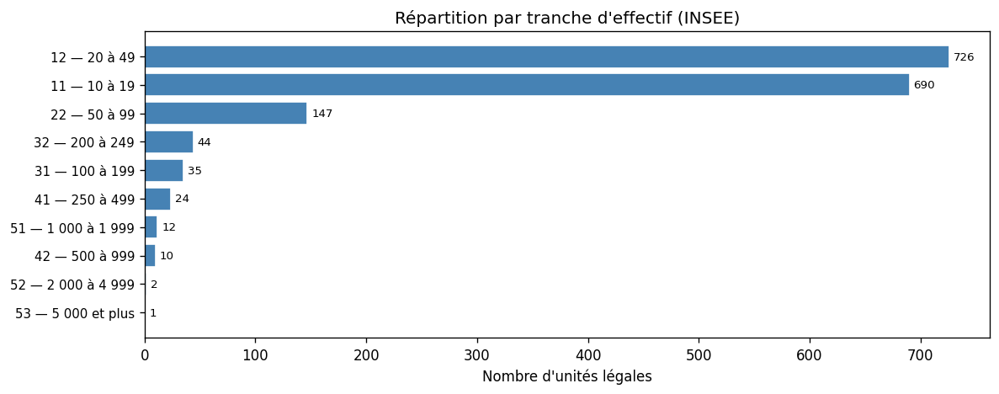
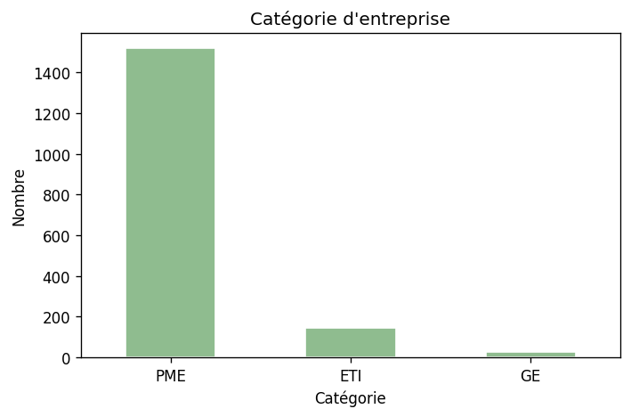
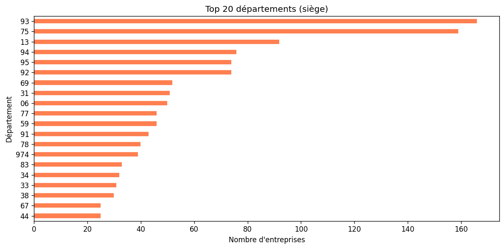
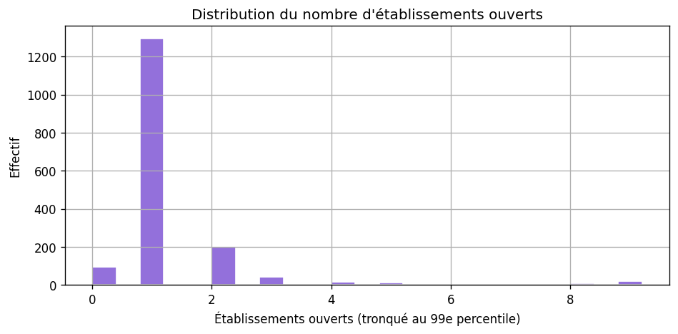

# Analyse des prospects — sécurité privée (NAF 80.10Z)

**Fichier :** `data/prospects_securite_8010z.csv`  
**Notebook (historique) :** `notebooks/analyse_prospects_securite_8010z.ipynb`  
**Notebook paramétrable :** `notebooks/analyse_prospects_sectoriel.ipynb` (`SECTOR_ID = "securite-privee"`)

Méthode commune : [METHODOLOGIE-API.md](./METHODOLOGIE-API.md).

**Jeu analysé :** 1 691 unités légales (tranches effectif ≥ 10 salariés).

```bash
python scripts/prospecting/fetch_sector_prospects.py --sector securite-privee
# ou : python scripts/prospecting/fetch_securite_privee_sirene.py --out data/prospects_securite_8010z.csv
python scripts/prospecting/export_analysis_figures.py --sector securite-privee
```

---

## Qualité et volumes

| Indicateur | Valeur |
|------------|--------|
| Lignes | 1 691 |
| SIREN uniques | 1 691 |
| Dirigeants renseignés (API) | ~99,4 % |
| Shortlist ICP indicative (PME, 10–49 sal., ≥ 2 établ.) | 150 |

**Catégories :** PME 1 518 · ETI 146 · GE 27  

**Établissements ouverts (médiane / max) :** 1 / 75  

**Top départements siège :** 93, 75, 13, 94, 95  

---

## Calibration clients (trois paliers)

**Produit déjà en production** pour ce secteur : les **fourchettes CA / prix** doivent être **recalibrées** avec un opérationnel sécurité privée. La **logique** (seuil minimal → cœur → plafond bootstrap) est la même que pour l’accueil du jeune enfant : **multi-sites / effectifs** + accessibilité du décideur.

Pour **comparer** les volumes avec les autres verticales sur la même mécanique de proxy API, les règles de comptage sont **alignées** sur celles des crèches (`stats-secteurs.json` → `securite-privee.segments_clients`).

### Unités légales dans ce fichier (proxy API, règles type « crèches »)

| Palier | UL |
|--------|-----|
| Seuil minimal | **16** |
| Cœur de cible | **5** |
| Plafond bootstrap | **0** |

Le **0** au plafond indique qu’avec les tranches effectif et catégories utilisées ici, **aucune** UL ne recoupe le créneau « 15–30 étab. + grosses tranches salariales » — les **gros réseaux** sont plutôt en **GE** ou hors tranches TEF retenues ; à affiner si tu élargis le périmètre export.

---

## Tranches d’effectif (INSEE)

| Code | Effectif salarié | Nombre |
|------|------------------|--------|
| 11 | 10 à 19 | 690 |
| 12 | 20 à 49 | 726 |
| 22 | 50 à 99 | 147 |
| 31 | 100 à 199 | 35 |
| 32 | 200 à 249 | 44 |
| 41 | 250 à 499 | 24 |
| 42 | 500 à 999 | 10 |
| 51 | 1 000 à 1 999 | 12 |
| 52 | 2 000 à 4 999 | 2 |
| 53 | 5 000 et plus | 1 |









---

## Lecture stratégique (rappel)

Douleur **binaire** (CNAPS, habilitations) ; multi-sites **réel** pour les réseaux mais moins « natif » que crèches / EHPAD. Voir [SYNTHESE-COMPARATIVE-SECTEURS.md](./SYNTHESE-COMPARATIVE-SECTEURS.md).
